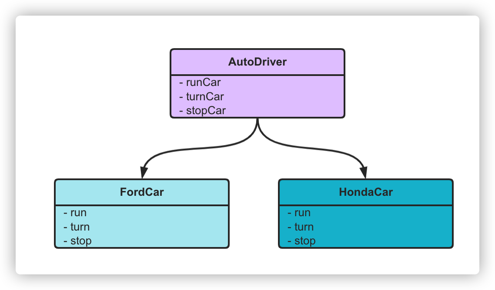
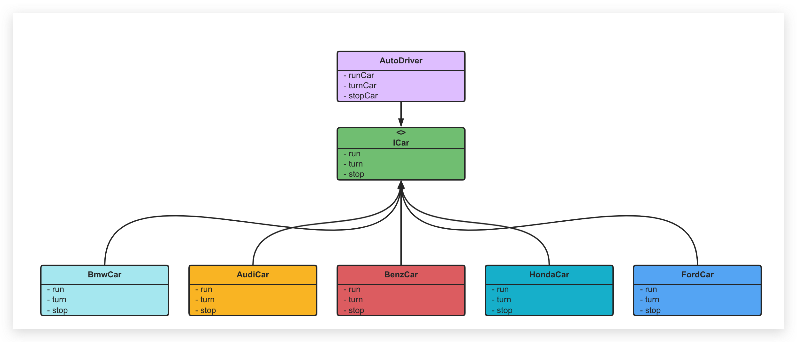

# 依赖倒置

> `「依赖倒置」`原则的英文翻译是 `Dependency Inversion Principle`，缩写为 `DIP`。中文翻译有时候也叫`「依赖反转」`原则。

「依赖倒置」是七大设计原则之二，在生产实际中应用的非常广泛，主要内容为:

1. 高层模块(high-level modules)不要直接依赖低层模块(low-level)；
2. 高层模块和低层模块应该通过抽象(abstractions)来互相依赖；
3. 抽象(abstractions)不要依赖具体实现细节(details)，具体实现细节(details)依赖抽象(abstractions)。

## 代码示例

陀螺研发了一套自动驾驶系统，在积极谈判之下和本田以及福特达成了合作协议，两个厂商各自提供汽车启动、转弯和停止的api供自动驾驶调用，系统就能实现自动驾驶。

代码如下

```typescript
/**
 * @author microld
 * @desc 福特汽车厂商提供的接口
 */
class FordCar {
  public run(): void {
    console.log("福特开始启动了");
  }

  public turn(): void {
    console.log("福特开始转弯了");
  }

  public stop(): void {
    console.log("福特开始停车了");
  }
}

/**
 * @author microld
 * @desc 本田汽车厂商提供的接口
 */
class HondaCar {
    public run(): void {
      console.log("本田开始启动了");
    }

    public turn(): void {
      console.log("本田开始转弯了");
    }

    public stop(): void {
      console.log("本田开始停车了");
    }
}

enum CarType {
  Ford, 
  Honda
}

/**
 * @author microld
 * @desc 自动驾驶系统
 */
class AutoDriver {    
  private hondaCar: HondaCar = new HondaCar();

  private fordCar: FordCar = new FordCar();

  public constructor(private type: CarType) {}

  public runCar(): void {
    if (this.type == CarType.Ford) {
      this.fordCar.run();
    } else {
      this.hondaCar.run();
    }
  }

  public turnCar(): void {
    if (this.type == CarType.Ford) {
      this.fordCar.turn();
    } else {
      this.hondaCar.turn();
    }
  }

  public stopCar(): void {
    if (this.type == CarType.Ford) {
      this.fordCar.stop();
    } else {
      this.hondaCar.stop();
    }
  }
}
```

自动驾驶系统运转良好，很快，奥迪和奔驰以及宝马纷纷找到陀螺寻求合作，陀螺不得不把代码改成这个样子。

```typescript
enum CarType {
  Ford, 
  Honda,
  Audi, 
  Benz, 
  Bmw
}

/**
 * @author microld
 * @desc 自动驾驶系统
 */
class AutoDriver {    
  private hondaCar: HondaCar = new HondaCar();

  private fordCar: FordCar = new FordCar();

  private audiCar: AudiCar = new AudiCar();
  
  private benzCar: BenzCar = new BenzCar();
  
  private bmwCar: BmwCar = new BmwCar();

  public constructor(private type: CarType) {}

  public runCar(): void {
    if (this.type === CarType.Ford) {
      this.fordCar.run();
    } else if (this.type === CarType.Honda) {
      this.hondaCar.run();
    } else if (this.type === CarType.Audi) {
      this.audiCar.run();
    } else if (this.type === CarType.Benz) {
      this.benzCar.run();
    } else {
      this.bmwCar.run();
    }
  }

  public turnCar(): void {
    if (this.type === CarType.Ford) {
      this.fordCar.turn();
    } else if (this.type === CarType.Honda) {
      this.hondaCar.turn();
    } else if (this.type === CarType.Audi) {
      this.audiCar.turn();
    } else if (this.type === CarType.Benz) {
      this.benzCar.turn();
    } else {
      this.bmwCar.turn();
    }
  }

  public stopCar(): void {
    if (this.type === CarType.Ford) {
      this.fordCar.stop();
    } else if (this.type === CarType.Honda) {
      this.hondaCar.stop();
    } else if (this.type === CarType.Audi) {
      this.audiCar.stop();
    } else if (this.type === CarType.Benz) {
      this.benzCar.stop();
    } else {
      this.bmwCar.stop();
    }
  }
}
```

如果看过开闭原则的文章，你会马上意识到这段代码不符合开闭原则。没错，一段代码可能同时不符合多种设计原则，那针对今天的「依赖倒置」原则，这段代码问题出现在哪里呢？

我们再来看一下「依赖倒置」原则的要求：

1. 高层模块(high-level modules)不要直接依赖低层模块(low-level)；
2. 高层模块和低层模块应该通过抽象(abstractions)来互相依赖；
3. 抽象(abstractions)不要依赖具体实现细节(details)，具体实现细节(details)依赖抽象(abstractions)。

针对第 1 点，高层模块 `AutoDriver` 直接依赖了低层模块 `XXXCar`，体现就是在 `AutoDriver` 中直接 `new` 了具体的汽车对象。因此也就没有做到第 2 点和第 3 点。UML 类图如下：



那我们就在高层模块和低层模块之间加一层抽象吧，定义一个接口 `ICar`，表示抽象的汽车，这样 `AutoDriver` 直接依赖的就是抽象 `ICar`，看代码：

```typescript
/**
 * @desc 抽象的汽车接口，由自动驾驶系统定义标准
 */
interface ICar {
  run(): void;
  turn(): void;
  stop(): void;
}

/**
 * @desc 福特汽车厂商提供的实现
 */
class FordCar implements ICar {
  public run(): void {
    console.log("福特开始启动了");
  }

  public turn(): void {
    console.log("福特开始转弯了");
  }

  public stop(): void {
    console.log("福特开始停车了");
  }
}

/**
 * @desc 本田汽车厂商提供的实现
 */
class HondaCar implements ICar {
  public run(): void {
    console.log("本田开始启动了");
  }

  public turn(): void {
    console.log("本田开始转弯了");
  }

  public stop(): void {
    console.log("本田开始停车了");
  }
}

/**
 * @desc 奥迪汽车厂商提供的实现
 */
class AudiCar implements ICar {
  public run(): void {
    console.log("奥迪开始启动了");
  }

  public turn(): void {
    console.log("奥迪开始转弯了");
  }

  public stop(): void {
    console.log("奥迪开始停车了");
  }
}

/**
 * @desc 奔驰汽车厂商提供的实现
 */
class BenzCar implements ICar {
  public run(): void {
    console.log("奔驰开始启动了");
  }

  public turn(): void {
    console.log("奔驰开始转弯了");
  }

  public stop(): void {
    console.log("奔驰开始停车了");
  }
}

/**
 * @desc 宝马汽车厂商提供的实现
 */
class BmwCar implements ICar {
  public run(): void {
    console.log("宝马开始启动了");
  }

  public turn(): void {
    console.log("宝马开始转弯了");
  }

  public stop(): void {
    console.log("宝马开始停车了");
  }
}

/**
 * @desc 自动驾驶系统，只依赖抽象 ICar
 */
class AutoDriver {
  public constructor(private car: ICar) {}

  public runCar(): void {
    this.car.run();
  }

  public turnCar(): void {
    this.car.turn();
  }

  public stopCar(): void {
    this.car.stop();
  }
}
```

重构之后我们发现高层模块 `AutoDriver` 直接依赖于抽象 `ICar`，而不是直接依赖 `XXXCar`，这样即使有更多的汽车厂家加入合作也不需要修改 `AutoDriver`，这就是高层模块和低层模块之间通过抽象进行依赖。

此外，`ICar` 也不依赖于 `XXXCar`，因为 `ICar` 是高层模块定义的抽象，汽车厂家如果想达成合作，就必须遵循 `AutoDriver` 定义的标准，即需要实现 `ICar` 的接口，这就是第 3 条所说的具体细节依赖于抽象！

我们看一下重构之后的 UML 图：



可以看到，原本是 `AutoDriver` 直接指向 `XXXCar`，现在是 `AutoDriver` 直接指向抽象 `ICar`，而各种 `XXXCar` 反过来指向 `ICar`，依赖的方向被"倒置"了，这就是所谓的「依赖倒置（反转）」。

看到这里，不知道你是不是对「依赖倒置」原则有了深刻的理解。